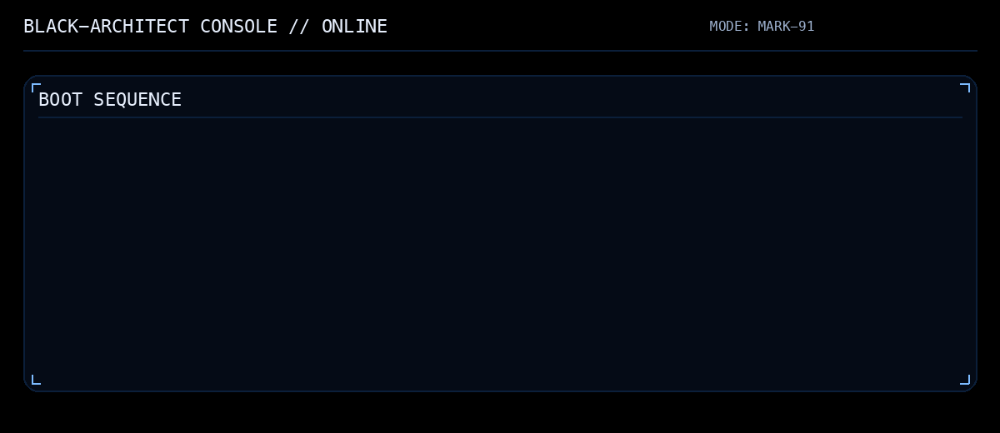

### SYSTEM BOOT 

## OPERATING PRINCIPLES

Design systems that remain stable  
under real users, real scale, and real uncertainty.

Most prototypes succeed.  
Production environments determine what survives.

Research → Architecture → Deployment → Reality

# ACTIVE SYSTEMS

## ARCHITECTURE PHILOSOPHY

I build systems to observe their limits,  
then redesign them so those limits move.

# CURRENT FOCUS

- Reinforcement Learning Systems  
- Large-Scale LLM Infrastructure  
- MLOps & Production Reliability  
- Architectures that degrade gracefully under stress  

# GITHUB METRICS

 

# CONTRIBUTION PATTERN

